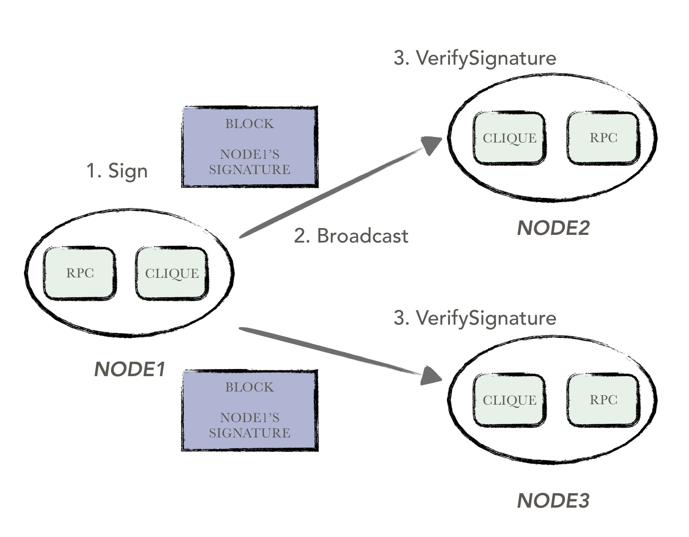
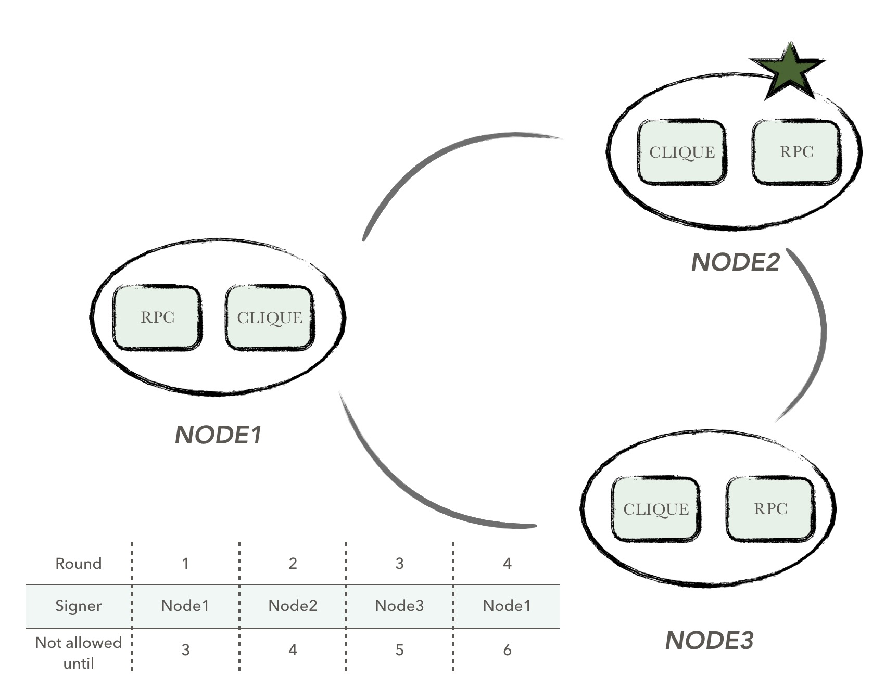
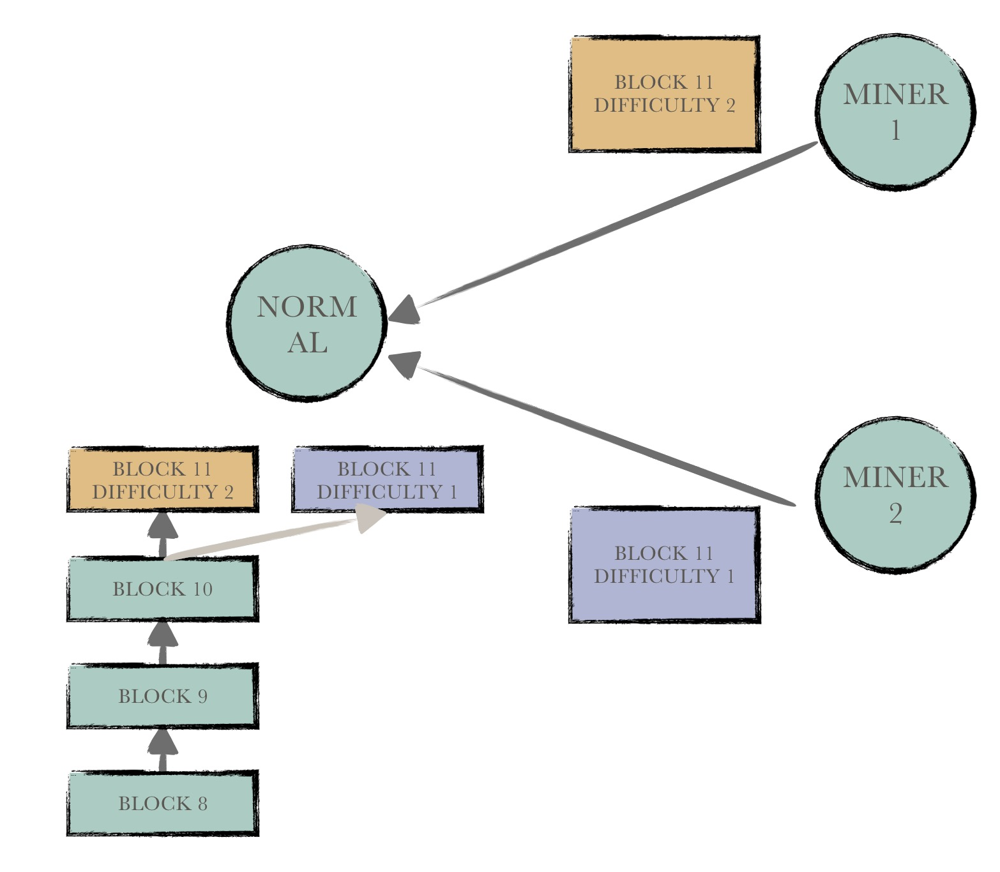
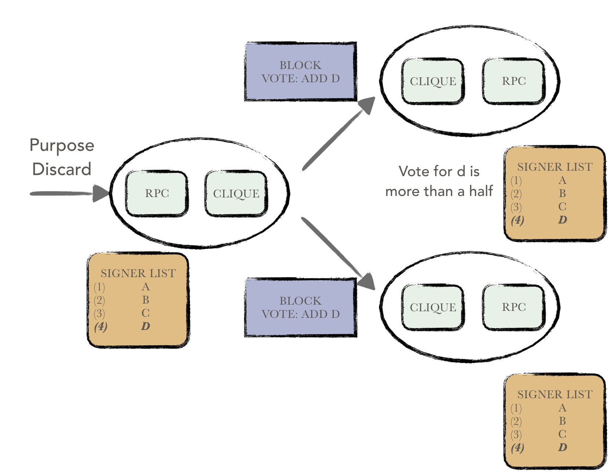

## Clique共识算法

### 背景

在以太坊中，默认使用ethash（pow）共识算法进行网络正确性的保障，这种共识算法采用的是工作量证明的机制，也就是我们所熟知的“挖矿”。

除了主网络，以太坊社区还提供了测试网络供dapp开发者进行开发调试。由于dapp的运行需要消耗一定的gas，在测试网络中进行开发调试，可以帮助开发者节省经济成本。

以太坊的第一个测试网络**Morden**从2015年7月开始运行，直至2016年的11月，由于不同客户端之间不共识的问题，导致区块链分叉而被弃用。

以太坊的第二个测试网络**Ropsten**与此同时被部署，直至运行到2017年的2月，由于测试网络本身算力不足，恶意攻击者在网络中传递巨大的区块数据，导致整体网络瘫痪，造成区块链分叉，测试网络再次不可用。

**Ropsten**网络瘫痪的根本原因是测试网络中没有足够算力来支撑ethash共识算法，导致共识算法失去作用。即便是重新部署一个测试网络，也无法解决该问题，因此，所有工作量证明类的算法都不适用于测试网络。

自然而然，大家把目光转向了casper（pos）共识算法，但是casper算法距离真正使用仍有一段距离，为了弥补这段时间内的空缺，以太坊go team的leader *Péter Szilágyi*提出了一种基于认证的共识算法**Clique**。这种算法的原理十分简单，即网络中的每一个区块是由某一个*认证节点*进行认证的，其他节点仅需要验证*认证信息*来判断该区块是否合法。

### 区块认证

#### 节点类别

在介绍算法原理之前，首先介绍一下在clique算法中，节点的分类。

节点可以分为两类：

* 认证节点
* 非认证节点

前者具有为一个区块签名的权利，可以对应pow算法中的矿工节点；

后者不具备签名的权利，是区块链网络中的普通同步节点；

两者可以相互转换，而这种*动态管理所有认证节点的机制*也是clique算法的难点与精髓之一。

#### 认证原理

clique中使用的认证原理非常简单，借用了**椭圆曲线数字签名算法**进行实现。

每一个认证节点，可以利用本地节点的私钥对一个区块的数据进行签名，并将产生的数字签名放置在区块头中；

其他节点在接收到该区块后，利用数字签名和区块数据反解出签名节点的公钥信息，并截取出相应的节点地址，若该节点地址在本地节点所维护的*认证节点列表中*，且该区块通过所有共识相关的检测，则认为该区块是合法的；否则就认为接收到了一个恶意区块。

为了不破坏区块本身的数据结构，clique在实现时复用了之前定义的字段，将认证节点的签名放在区块头的extraData字段中。



#### 机会均等

为了使得出块的负载（或者说是机会）对于每个认证节点尽量均等，同时避免某些恶意节点持续出块，clique中规定每一个认证节点在连续的`SIGNER_LIMIT`个区块中，最多只能签发一个区块，也就是说，每一轮中，最多只有`SIGNER_COUNT - SIGNER_LIMIT`个认证节点可以参与区块签发。

其中`SIGNER_LIMIT = floor(SIGNER_COUNT / 2) + 1`，`SIGNER_COUNT`表示认证节点的个数。

这样设计的目的：

在保证*好*节点的个数大于*坏*节点的前提下，*好*节点最少的个数为`SIGNER_LIMIT`（大于50%），坏节点最多的个数为`SIGNER_COUNT - SIGNER_LIMIT`（小于50%）。一个节点在`SIGNER_LIMIT`这个时间窗口内最多只能签发一个区块，这就使得恶意节点在不超过50%的情况下，从理论上无法一直掌握区块的签发权。



#### 难度计算

在以太坊中，每个节点都会维护一条**难度总值最大**的区块链作为主链，在其他叉链上的区块成为叔区块。因此为了兼容现有的架构，clique中同样有难度值这个概念。

为了让每个认证节点都有均等的机会去签发一个区块，每个节点在签发时都会判断本节点是不是本轮的“inturn”节点，若是inturn节点，则该节点产生的区块难度为2，否则为1。每一轮仅有一个节点为inturn节点。

判断当前节点是否为inturn节点的方法十分简单，将本地维护的认证节点按照字典序排序，若当前区块号除以认证节点个数的余数等于该节点的下标，则该节点为inturn节点。

```Go
// inturn returns if a signer at a given block height is in-turn or not.
func (s *Snapshot) inturn(number uint64, signer common.Address) bool {
	signers, offset := s.signers(), 0
	for offset < len(signers) && signers[offset] != signer {
		offset++
	}
	return (number % uint64(len(signers))) == uint64(offset)
}
```

为inturn节点设计更高难度值的目的是：使得区块链能够朝着某一个方向进行收敛。倘若所有节点签发区块的难度没有区别，则会出现多条难度相同的叉链导致网络无法达成共识。

但是即便inturn节点能够签发高难度区块，其他节点竟然会参与竞争。这是因为inturn节点可能在此期间处于离线状态，其他节点可以弥补inturn节点的空缺，继续为网络签发区块。不过这也就会导致这一轮可能会有若干条不同状态的区块链产生（因为其他节点签发的难度值相同），这种状态最终会通过下一轮或者下几轮inturn节点签发的高难度区块而达到收敛。

**缺陷**

inturn节点拥有签发高难度区块的权利，从理论上来说，也就是“预定”了本轮区块竞赛最终的胜者会是这个inturn节点，这也是clique算法不完备的地方，恶意攻击者可以预知每一轮的出块者，并且提前向他发起攻击。

#### 区块分发

clique算法每一轮出块的间隔时间是可配置的，假设每一轮出块的时间配置为10秒，那么每个认证节点在完成一个区块的签名流程后，会计算当前区块的时间戳，计算方式为父区块的时间加上10秒，并且延迟至该时间才向外广播区块。

但是在一轮区块竞赛中，网络中会有`SIGNER_COUNT` - `SIGNER_LIMIT`个认证节点可以参与签发区块，为了**避免网络拥堵**以及不必要的**区块链重组**，在每个节点完成签发，分发区块之前，采用了非inturn节点延迟分发的优化。

具体的策略为非inturn节点随机延迟`rand(SIGNER_LIMIT)*500ms`的时间，而inturn节点不增加额外的延迟时间。

```Go
// Sweet, the protocol permits us to sign the block, wait for our time
	delay := time.Unix(header.Time.Int64(), 0).Sub(time.Now())
	if header.Difficulty.Cmp(diffNoTurn) == 0 {
		// It's not our turn explicitly to sign, delay it a bit
		wiggle := time.Duration(len(snap.Signers)/2+1) * wiggleTime
		delay += time.Duration(rand.Int63n(int64(wiggle)))
	}
	select {
	case <-stop:
		return nil, nil
	case <-time.After(delay):
	}
```

> 区块链重组：
>
> 由于在以太坊网络中，每个节点接收到不同”矿工“节点产生的区块时间不同，因此可能产生首先接收到了一个难度值较低的区块，随后又接收到了一个难度值更高且处于同一高度的新区块，当发生这种这种情况时，便会进行区块链头部的切换，以总难度值最大的区块链为主链。



#### 区块验证

普通节点在收到一个新区块时，会从区块头的extraData字段中取出认证节点的签名，利用标准的`spec256k1`椭圆曲线进行反解公钥信息，并且从公钥中截取出签发节点的地址，若该节点是认证节点，且该节点本轮拥有签名的权限，则认为该区块为合法区块。

### 基于投票的认证节点维护

clique的区块认证机制十分简单，难点在于如何动态地维护认证节点列表信息。因此，clique中采用了一种基于投票的认证节点维护机制。

首先先介绍几个基本概念：

* **signer**

  认证节点


* **purposal**

  用户可以利用rpc接口发起一次purposal，指定要加入或移除某一个认证节点。一个purposal的结构为（1）需要改变状态的认证节点的地址（2）新状态；

* **vote**

  每个**认证节点**在每一轮**签发区块**时，都会从`pending`的purposal池里随机挑选一个purposal，并将purposal的目标节点地址填在`beneficiary`字段中，将新状态填在`nonce`字段中，以此作为一次投票；

* **tally**

  每个认证节点本地会维护一个投票结果计数器tally，其中记录了每一个被选举节点（1）新状态<加入或移除> （2）已经获取的票数。一旦获得票数超过半数，就立即更改认证节点的状态；

clique的一次投票流程如下图所示：

1. 用户通过rpc接口发起一次请求，要求对地址为a的节点进行状态变更，将其从普通节点变为认证节点或者从认证节点变为普通节点。生成的请求会缓存在本地的purposal池中，等待应用；
2. **本地认证节点**在一次区块打包的过程中，从purposal池中随机挑选一条*还未被应用*的purposal，并将信息填入区块头，将区块广播给其他节点；
3. 其他节点在接收到区块后，取出其中的信息，封装成一个vote进行存储，并将投票结果应用到本地，若关于目标节点的状态更改获得的一致投票超过半数，则更改目标节点的状态：
   1. 若为新增认证节点，将目标节点的地址添加到本地的认证节点的列表中；
   2. 若为删除认证节点，将目标节点的地址从本地的认证节点列表中删除；

较为复杂的情况是删除一个认证节点。由于认证节点的减少，导致之前还未到达共识的purposal由于节点数的减少而达到了一致，也就是说在一次投票应用的过程中，可能会有多个purposal同时达到满足条件，针对这种情况，clique规定在一个投票应用中，只能对`beneficiary`字段指定的地址进行状态变更，而对于其他的purposal，需要等待到下一次`beneficiary`与其目标地址一致时才可以被触发。



**注意**：由于可能发生区块链重组的情况，因此即便一个新的认证节点被加入，或者被删除，都有可能发生**回滚**。

#### checkpoint

为了防止某些恶意节点不断地发起purposal，导致每个节点在内存中维护大量的投票统计信息，clique加入了一个checkpoint机制。每隔一个`epoch`，所有节点将pending状态的投票信息、统计信息都删除，并在这个区块头中填入当前所有认证节点的地址信息，供其他节点进行一次状态同步。

这样做的优势是：

1. 避免了维护统计信息无限增大的内存开销；
2. 使得新加入的节点不必要从头同步区块数据，来重放投票过程生成认证节点地址列表，而直接通过checkpoint的区块获取完整的认证节点地址（例如fast sync）；

**注意**：可以看到，其实与区块数据一样，认证节点信息在各个节点的每一个阶段也都是严格的一致的！换一句话说，认证节点的信息也是**“编码”**在区块信息中的。例如初始的认证节点信息被编码在创世区块的区块头中。所有新加入的节点通过不断重放投票过程可以得到相同的认证节点信息。这也就能够保证新节点加入时，无论采用哪种同步方式（normal, fast, light, warp），都能够在每一个阶段得到一致的结果。

### 搭建Clique私有网络

在介绍了clique算法的实现原理后，在本章中简要介绍一下如何利用`puppeth`工具快速地搭建一个基于clique共识算法的私有网络。

**准备环境**

首先从[https://ethereum.github.io/go-ethereum/downloads/](https://ethereum.github.io/go-ethereum/downloads/)下载go-ethereum即辅助工具，创建四个节点的目录，并在每个节点目录下创建一个账户。

```
mkdir node1 node2 node3 node4
for i in 1 2 3 4; do geth --datadir node$i/data account new; done
```

 **生成genesis文件**

利用puppeth工具生成使用clique算法的genesis文件

```Shell
$ puppeth
+-----------------------------------------------------------+
| Welcome to puppeth, your Ethereum private network manager |
|                                                           |
| This tool lets you create a new Ethereum network down to  |
| the genesis block, bootnodes, miners and ethstats servers |
| without the hassle that it would normally entail.         |
|                                                           |
| Puppeth uses SSH to dial in to remote servers, and builds |
| its network components out of Docker containers using the |
| docker-compose toolset.                                   |
+-----------------------------------------------------------+

Please specify a network name to administer (no spaces, please)
> garden
```

```Shell
Sweet, you can set this via --network=garden next time!

INFO [11-21|13:42:36] Administering Ethereum network           name=garden
WARN [11-21|13:42:36] No previous configurations found         path=/Users/gary/.puppeth/garden

What would you like to do? (default = stats)
 1. Show network stats
 2. Configure new genesis
 3. Track new remote server
 4. Deploy network components
> 2
```

```shell
Which consensus engine to use? (default = clique)
 1. Ethash - proof-of-work
 2. Clique - proof-of-authority
> 2
```

```shell
How many seconds should blocks take? (default = 15)
> 10
# 选择一个节点账号作为创始的认证节点
Which accounts are allowed to seal? (mandatory at least one)
> 0xe4b38fb40123740a6fdce5da8e4faebc663c0b7f
> 0x
# 选择若干个账户为其添加初始以太币
Which accounts should be pre-funded? (advisable at least one)
> 0xe4b38fb40123740a6fdce5da8e4faebc663c0b7f
> 0xe29513049a329c1e1e54e366b42434ccf49dcf48
> 0x
```

```
Specify your chain/network ID if you want an explicit one (default = random)
>

Anything fun to embed into the genesis block? (max 32 bytes)
> None
```

然后利用puppeth工具导出，即可在当前目录中看到生成的genesis文件。

```Shell
What would you like to do? (default = stats)
 1. Show network stats
 2. Manage existing genesis
 3. Track new remote server
 4. Deploy network components
> 2

 1. Modify existing fork rules
 2. Export genesis configuration
> 2

Which file to save the genesis into? (default = garden.json)
>
INFO [11-21|13:46:14] Exported existing genesis block
```

**应用genesis**

```Shell
for i in 1 2 3 4; do geth --datadir node$i/data init garden.json; done
```

**启动节点**

从genesis文件中查到networkId，并以此启动四个节点（注意网络Id必须与genesis区块中记载的是一致的，且每个node对应的端口号须不一样，unlock的账号也为本节点对应的账号）

```Shell
geth --datadir node1/data --networkid 18904 --port 10001 --unlock 139af9691eee4836550461b1b631eee1af958a35 console
```

**添加对端节点**

每个节点在网络中都会有一个唯一的标识enode，该信息可以从节点启动日志中读取。由于目前该网络中没有一个bootnode，因此四个节点即使在同一个网络中，也无法进行互联，所有我们在node2,node3,node4中依次添加node1的信息，使得这三个节点都与node1组成一个星状网络。

```Shell
admin.addPeer("enode://54790190c258daef3b220dfd0ed06233d52cb6ed30eb74c576b739941ad37422bcf895cb06baa975f7f5ad4f69dbea19d7fbe9106cf539adf43d4007b576cacc@127.0.0.1:10001")
```

> 注意要把@后的ip地址改为127.0.0.1

完成以后，在node1中查看已经连接的对端点，可以看到已经有三个对端点了

```Shell
admin.peers
```

**启动clique**

还记得我们在配置genesis的时候，将节点1中的账户添加到了sealer中了，即node1已经具备了认证区块的资格了，在node1中输入以下命令，node1就开始正常工作了。

```Shell
miner.start()
```

**新增认证节点**

目前网络中共有1个认证节点node1，根据算法，只需要超过一半的认证节点同意新增该节点，该节点即可变成一个新的认证节点，因此在这里只需要由node1发起一个purposal，即可添加新的认证节点。

```shell
# 将node2添加进认证节点中
clique.propose("0xe29513049a329c1e1e54e366b42434ccf49dcf48", true)
```

```Shell
cique.getSnapshot()
{
  hash: "0x75b5997bc31547aa3cb2d0ccd1de707a0bfc3a827b98c11951dbdce8cbcf72d2",
  number: 58,
  recents: {
    58: "0xe4b38fb40123740a6fdce5da8e4faebc663c0b7f"
  },
  signers: {
    0xe29513049a329c1e1e54e366b42434ccf49dcf48: {},
    0xe4b38fb40123740a6fdce5da8e4faebc663c0b7f: {} # node2已经成为了新的认证节点
  },
  tally: {},
  votes: []
}
```

### 作者简介

戎佳磊，浙江大学VLIS实验室在读研究生。

以太坊爱好者&贡献者

趣链科技工程师&hyperchain平台核心开发

rongjialei@hyperchain.cn

### 参考文献

1. [https://medium.com/taipei-ethereum-meetup/%E4%BD%BF%E7%94%A8-go-ethereum-1-6-clique-poa-consensus-%E5%BB%BA%E7%AB%8B-private-chain-1-4d359f28feff](https://medium.com/taipei-ethereum-meetup/%E4%BD%BF%E7%94%A8-go-ethereum-1-6-clique-poa-consensus-%E5%BB%BA%E7%AB%8B-private-chain-1-4d359f28feff)
2. [https://github.com/ethereum/EIPs/issues/225](https://github.com/ethereum/EIPs/issues/225)