## Merkle Patricia Tree详解

### 1. 前言

#### 1.1 概述

Merkle Patricia Tree（又称为Merkle Patricia Trie）是一种经过改良的、融合了默克尔树和前缀树两种树结构优点的数据结构，是以太坊中用来组织管理账户数据、生成交易集合哈希的重要数据结构。

MPT树有以下几个作用：

* 存储任意长度的key-value键值对数据；
* 提供了一种快速计算所维护数据集哈希标识的机制；
* 提供了快速状态回滚的机制；
* 提供了一种称为***默克尔证明***的证明方法，进行轻节点的扩展，实现简单支付验证；

由于MPT结合了（1）前缀树（2）默克尔树两种树结构的特点与优势 ，因此在介绍MPT之前，我们首先简要地介绍下这两种树结构的特点。

####1.2 前缀树

前缀树（又称字典树），用于保存关联数组，其键（key）的内容通常为字符串。前缀树节点在树中的位置是由其键的内容所决定的，即前缀树的key值被编码在根节点到该节点的路径中。

如下图所示，图中共有6个叶子节点，其key的值分别为（1）to（2）tea（3）ted（4）ten（5）A（6）inn。

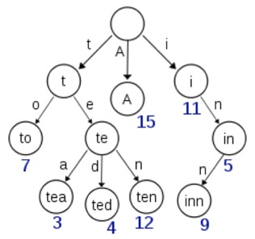


**优势**：

相比于哈希表，使用前缀树来进行查询拥有共同前缀key的数据时十分高效，例如在字典中查找前缀为pre的单词，对于哈希表来说，需要遍历整个表，时间效率为O(n)；然而对于前缀树来说，只需要在树中找到前缀为pre的节点，且遍历以这个节点为根节点的子树即可。

但是对于最差的情况（前缀为空串），时间效率为O(n)，仍然需要遍历整棵树，此时效率与哈希表相同。

相比于哈希表，使用前缀树进行数据的组织不存在哈希冲突的问题。

**劣势**：

* 直接查找效率低下

前缀树的查找效率是O(m)，m为所查找节点的key长度，而哈希表的查找效率为O(1)。且一次查找会有m次IO开销，相比于直接查找，无论是速率、还是对磁盘的压力，性能表现都不理想。

* 可能会造成空间浪费

当存在一个节点，其key值内容很长（如一串很长的字符串），当树中没有与它有相同前缀的分支时，为了存储该节点，需要创建许多非叶子节点来构建根节点到该节点间的路径，造成了存储空间的浪费。

#### 1.3 默克尔树

Merkle树是由计算机科学家 Ralph Merkle 在很多年前提出的，并以他本人的名字来命名,由于在比特币网络中用到了这种数据结构来进行数据正确性的验证，在这里简要地介绍一下merkle树的特点及原理。

在比特币网络中，merkle树被用来归纳一个区块中的所有交易，同时生成整个交易集合的数字指纹。此外，由于merkle树的存在，使得在比特币这种公链的场景下，扩展一种“轻节点”实现简单支付验证变成可能，关于轻节点的内容，将会下文详述。

**特点**

* 默克尔树是一种树，大多数是二叉树，也可以多叉树，无论是几叉树，它都具有树结构的所有特点；
* 默克尔树叶子节点的value是数据项的内容，或者是数据项的哈希值；
* 非叶子节点的value根据其孩子节点的信息，然后按照Hash算法计算而得出的；

**原理**

在比特币网络中，merkle树是自底向上构建的。在下图的例子中，首先将L1-L4四个单元数据哈希化，然后将哈希值存储至相应的叶子节点。这些节点是Hash0-0, Hash0-1, Hash1-0, Hash1-1

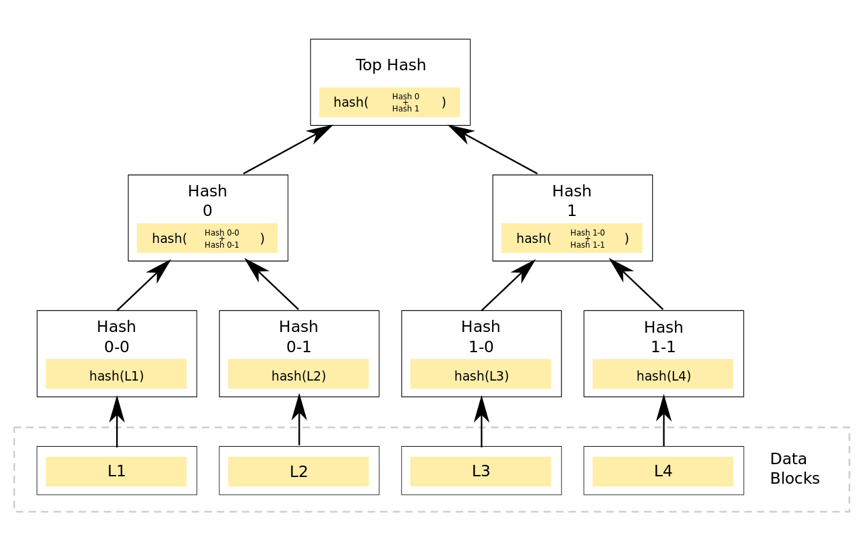

将相邻两个节点的哈希值合并成一个字符串，然后计算这个字符串的哈希，得到的就是这两个节点的父节点的哈希值。

如果该层的树节点个数是单数，那么对于最后剩下的树节点，这种情况就直接对它进行哈希运算，其父节点的哈希就是其哈希值的哈希值（对于单数个叶子节点，有着不同的处理方法，也可以采用复制最后一个叶子节点凑齐偶数个叶子节点的方式）。循环重复上述计算过程，最后计算得到最后一个节点的哈希值，将该节点的哈希值作为整棵树的哈希。

若两棵树的根哈希一致，则这两棵树的结构、节点的内容必然相同。

如上图所示，一棵有着4个叶子节点的树，计算代表整棵树的哈希需要经过7次计算，若采用将这四个叶子节点拼接成一个字符串进行计算，仅仅只需要一次哈希就可以实现，那么为什么要采用这种看似奇怪的方式呢？

**优势**：

* 快速重哈希

默克尔树的特点之一就是当树节点内容发生变化时，能够在前一次哈希计算的基础上，仅仅将被修改的树节点进行哈希重计算，便能得到一个新的根哈希用来代表整棵树的状态。

* 轻节点扩展

采用默克尔树，可以在公链环境下扩展一种“轻节点”。轻节点的特点是对于每个区块，仅仅需要存储约80个字节大小的区块头数据，而不存储交易列表，回执列表等数据。然而通过轻节点，可以实现在***非信任的公链环境中***验证某一笔交易是否被收录在区块链账本的功能。这使得像比特币，以太坊这样的区块链能够运行在个人PC，智能手机等拥有小存储容量的终端上。

**劣势**：

* 存储空间开销大

### 2. 术语解释

在下文中，会有些特定的专业术语，在这里首先对这些术语给出定义

* 世界状态：在以太坊中，所有账户（包括合约账户、普通账户）的状态数据统称为世界状态；
* 轻节点：指只存储区块头数据的区块链节点；
* 区块链分叉：指向同一个父块的2个区块被同时生成的情况，某些部分的矿工看到其中一个区块，其他的矿工则看到另外一个区块。这导致2种区块链同时增长；
* 区块头：指区块结构体的一部分，用于存储该区块的头部信息，如父区块哈希、世界状态哈希、交易回执集合哈希等。区块头仅存储一些“固定”长度的哈希字段；

### 3. 结构设计

在这一章节，将详细地介绍MPT树的结构设计，以及采用这种结构设计的用意、优化点。

#### 3.1 节点分类

如上文所述，尽管前缀树可以起到维护key-value数据的目的，但是其具有十分明显的局限性。无论是查询操作，还是对数据的增删改，不仅效率低下，且存储空间浪费严重。故，在以太坊中，为MPT树新增了几种不同类型的树节点，以尽量压缩整体的树高、降低操作的复杂度。

MPT树中，树节点可以分为以下四类：

* 空节点
* 分支节点
* 叶子节点
* 扩展节点

空节点用来表示空串。

**分支节点**

分支节点用来表示MPT树中所有拥有超过1个孩子节点以上的非叶子节点， 其定义如下所示：

```go
type fullNode struct {
		Children [17]node // Actual trie node data to encode/decode (needs custom encoder)
		flags    nodeFlag
}

// nodeFlag contains caching-related metadata about a node.
type nodeFlag struct {
	hash  hashNode // cached hash of the node (may be nil)
	gen   uint16   // cache generation counter
	dirty bool     // whether the node has changes that must be written to the database
}
```

与前缀树相同，MPT同样是把key-value数据项的key编码在树的路径中，但是key的每一个字节值的范围太大（[0-127]），因此在以太坊中，在进行树操作之前，首先会进行一个key编码的转换（下节会详述），将一个字节的高低四位内容分拆成两个字节存储。通过编码转换，`key'`的每一位的值范围都在[0, 15]内。因此，一个分支节点的孩子至多只有16个。以太坊通过这种方式，减小了每个分支节点的容量，但是在一定程度上增加了树高。

分支节点的孩子列表中，最后一个元素是用来存储自身的内容。

此外，每个分支节点会有一个附带的字段`nodeFlag`，记录了一些辅助数据：

* 节点哈希：若该字段不为空，则当该节点需要进行哈希计算时，可以跳过计算过程而直接使用上次计算的结果（当节点变脏时，该字段被置空）；
* 脏标志：当一个节点被修改时，该标志位被置为1；
* 诞生标志：当该节点第一次被载入内存中（或被修改时），会被赋予一个计数值作为诞生标志，该标志会被作为节点驱除的依据，清除内存中“太老”的未被修改的节点，防止占用的内存空间过多；

**叶子节点&&扩展节点**

叶子节点与扩展节点的定义相似，如下所示：

```Go
type shortNode struct {
		Key   []byte
		Val   node
		flags nodeFlag
}
```

其中关键的字段为：

* Key：用来存储***属于该节点范围的key***；
* Val：用来存储该节点的内容；

其中`Key`是MPT树实现树高压缩的关键！

如之前所提及的，前缀树中会出现严重的存储空间浪费的情况，如下图：

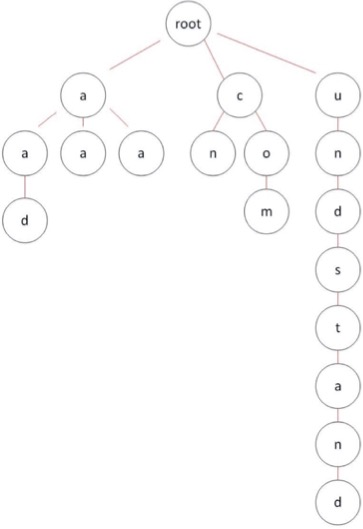

图中右侧有一长串节点，这些节点大部分只是充当非叶子节点，用来构建一条路径，目的只是为了存储该路径上的叶子节点。

针对这种情况，MPT树对此进行了优化：当MPT试图插入一个节点，插入过程中发现目前没有与该节点Key拥有相同前缀的路径。此时MPT把***剩余的Key***存储在叶子／扩展节点的Key字段中，充当一个”Shortcut“。

例如图中我们将红线所圈的节点称为node1, 将蓝线所圈的节点称为node2。node1与node2共享路径前缀t，但是node1在插入时，树中没有与oast有共同前缀的路径，*因此node1的key为oast*，实现了编码路径的压缩。


这种做法有以下几点优势：

* 提高节点的查找效率，避免过多的磁盘访问；

* 减少存储空间浪费，避免存储无用的节点；

  ​

此外Val字段用来存储叶子／扩展节点的内容，对于叶子节点来说，该字段存储的是一个数据项的内容；而对于扩展节点来说，该字段可以是以下两种内容：

1. Val字段存储的是其孩子节点在数据库中存储的索引值（其实该索引值也是孩子节点的哈希值）；
2. Val字段存储的是其孩子节点的引用；

>  为什么设计在扩展节点的Val字段有可能存储一串哈希值作为孩子节点的索引呢？
>
>  在以太坊中，该哈希代表着另外一个节点在数据库中索引，即根据这个哈希值作为数据库中的索引，可以从数据库中读取出另外一个节点的内容。
>
>  这种设计的目的是：
>
>  （1）当整棵树被持久化到数据库中时，保持节点间的关联关系；
>
>  （2）从数据库中读取节点时，尽量避免不必要的IO开销；
>
>  在内存中，父节点与子节点之间关联关系可以通过引用、指针等编程手段实现，但是当树节点持久化到数据库是，父节点中会存储一个子节点在数据库中的索引值，以此保持关联关系。
>
>  同样，从数据库中读取节点时，本着最小IO开销的原则，仅需要读取那些需要用到的节点数据即可，因此若目前该节点已经包含所需要查找的信息时，便无须将其子节点再读取出来；反之，则根据子节点的哈希索引递归读取子节点，直至读取到所需要的信息。

由于叶子／扩展节点共享一套定义，那么怎么来区分Val字段存储的到底是一个数据项的内容，还是一串哈希索引呢？在以太坊中，通过在Key中加入特殊的标志来区分两种类型的节点。

#### 3.2 key值编码

在以太坊中，MPT树的key值共有三种不同的编码方式，以满足不同场景的不同需求，在这里单独作为一节进行介绍。

三种编码方式分别为：

1. Raw编码（原生的字符）；
2. Hex编码（扩展的16进制编码）；
3. Hex-Prefix编码（16进制前缀编码）；

**Raw编码**

Raw编码就是原生的key值，不做任何改变。这种编码方式的key，是MPT对外提供接口的默认编码方式。

> 例如一条key为“cat”，value为“dog”的数据项，其Raw编码就是['c', 'a', 't']，换成ASCII表示方式就是[63, 61, 74]

**Hex编码**

在介绍分支节点的时候，我们介绍了，为了减少分支节点孩子的个数，需要将key的编码进行转换，将原key的高低四位分拆成两个字节进行存储。这种转换后的key的编码方式，就是Hex编码。

从Raw编码向Hex编码的转换规则是：

* 将Raw编码的每个字符，根据高4位低4位拆成两个字节；
* 若该Key对应的节点存储的是真实的数据项内容（即该节点是叶子节点），则在末位添加一个ASCII值为16的字符作为终止标志符；
* 若该key对应的节点存储的是另外一个节点的哈希索引（即该节点是扩展节点），则不加任何字符；

> key为“cat”, value为“dog”的数据项，其Hex编码为[3, 15, 3, 13, 4, 10, 16]

*Hex编码用于对内存中MPT树节点key进行编码*

**HP编码**

在介绍叶子／扩展节点时，我们介绍了这两种节点定义是共享的，即便持久化到数据库中，存储的方式也是一致的。那么当节点加载到内存是，同样需要通过一种额外的机制来区分节点的类型。于是以太坊就提出了一种***HP编码***对存储在数据库中的叶子／扩展节点的key进行编码区分。在将这两类节点持久化到数据库之前，首先会对该节点的key做编码方式的转换，即*从Hex编码转换成HP编码*。

HP编码的规则如下：

* 若原key的末尾字节的值为16（即该节点是叶子节点），去掉该字节；


* 在key之前增加一个半字节，其中最低位用来编码原本key长度的奇偶信息，key长度为奇数，则该位为1；低2位中编码一个特殊的终止标记符，若该节点为叶子节点，则该位为1；
* 若原本key的长度为奇数，则在key之前再增加一个值为0x0的**半字节**；
* 将原本key的内容作压缩，即将两个字符以高4位低4位进行组合，存储在一个字节中（Hex扩展的逆过程）；

> 若Hex编码为[3, 15, 3, 13, 4, 10, 16]，则HP编码的值为[32, 63, 61, 74]

*HP编码用于对数据库中的树节点key进行编码*

**转换关系**

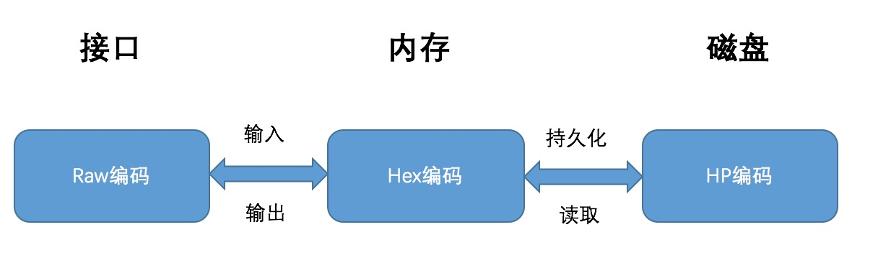

以上三种编码方式的转换关系为：

* Raw编码：原生的key编码，是MPT对外提供接口中使用的编码方式，当数据项被插入到树中时，Raw编码被转换成Hex编码；
* Hex编码：16进制扩展编码，用于对内存中树节点key进行编码，当树节点被持久化到数据库时，Hex编码被转换成HP编码；
* HP编码：16进制前缀编码，用于对数据库中树节点key进行编码，当树节点被加载到内存时，HP编码被转换成Hex编码；

####  3.3 安全的MPT

以上介绍的MPT树，可以用来存储内容为任何长度的key-value数据项。倘若数据项的key长度没有限制，当树中维护的数据量较大时，仍然会造成整棵树的深度变得越来越深，会造成以下影响：

* 查询一个节点可能会需要许多次IO读取，效率低下；
* 系统易遭受Dos攻击，攻击者可以通过在合约中存储特定的数据，“构造”一棵拥有一条很长路径的树，然后不断地调用`SLOAD`指令读取该树节点的内容，造成系统执行效率极度下降；
* 所有的key其实是一种明文的形式进行存储；

为了解决以上问题，在以太坊中对MPT再进行了一次封装，对数据项的key进行了一次哈希计算，因此最终作为参数传入到MPT接口的数据项其实是`(sha3(key), value)`

**优势**：

* 传入MPT接口的key是固定长度的（32字节），可以避免出现树中出现长度很长的路径；

**劣势**：

* 每次树操作需要增加一次哈希计算；
* 需要在数据库中存储额外的`sha3(key)`与`key`之间的对应关系；

### 4.  基本操作  

介绍完MPT树的组成结构，在这一章将介绍MPT几种核心的基本操作。

#### 4.1 Get

一次Get操作的过程为：

1. 将需要查找Key的Raw编码转换成Hex编码，得到的内容称之为*搜索路径*；
2. 从根节点开始搜寻与*搜索路径*内容一致的路径；
   1. 若当前节点为叶子节点，存储的内容是数据项的内容，且*搜索路径的内容*与叶子节点的key一致，则表示找到该节点；反之则表示该节点在树中不存在。
   2. 若当前节点为扩展节点，且存储的内容是哈希索引，则利用哈希索引从数据库中加载该节点，再将*搜索路径*作为参数，对新加载的节点递归地调用查找函数。
   3. 若当前节点为扩展节点，存储的内容是另外一个节点的引用，且当前节点的key是*搜索路径*的前缀，则将*搜索路径*减去当前节点的key，将剩余的*搜索路径*作为参数，对其子节点递归地调用查找函数；若当前节点的key不是*搜索路径*的前缀，表示该节点在树中不存在。
   4. 若当前节点为分支节点，若*搜索路径*为空，则返回分支节点的存储内容；反之利用*搜索路径*的第一个字节选择分支节点的孩子节点，将剩余的*搜索路径*作为参数递归地调用查找函数。

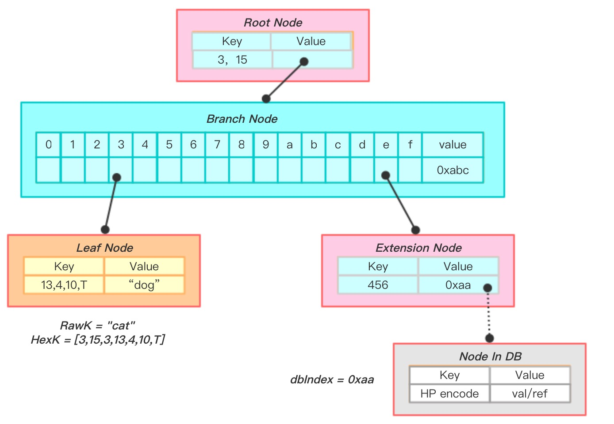


上图是一次查找key为”cat“节点的过程。

1.  将key"cat"转换成hex编码[3,15,3,13,4,10,T] （在末尾添加终止符是因为需要查找一个真实的数据项内容）；
2.  当前节点是根节点，且是扩展节点，其key为3,15，则递归地对其子节点进行查找调用，剩余的搜索路径为[3,13,4,10,T];
3.  当前节点是分支节点，以搜索路径的第一个字节内容3选择第4个孩子节点递归进行查找，剩余的搜索路径为[13,4,10,T]；
4.  当前节点是叶子节点，且key与剩余的搜索路径一致，表示找到了该节点，返回Val为“dog”；

#### 4.2 Insert 

插入操作也是基于查找过程完成的，一个插入过程为：

1. 根据4.1中描述的查找步骤，首先找到与新插入节点拥有**最长相同路径前缀**的节点，记为Node；
2. 若该Node为分支节点：
   1. 剩余的搜索路径不为空，则将新节点作为一个叶子节点插入到对应的孩子列表中；
   2. 剩余的搜索路径为空（完全匹配），则将新节点的内容存储在分支节点的第17个孩子节点项中（Value）；
3. 若该节点为叶子／扩展节点：
   1. 剩余的搜索路径与当前节点的key一致，则把当前节点Val更新即可；
   2. 剩余的搜索路径与当前节点的key不完全一致，则将**叶子／扩展节点的孩子节点替换成分支节点**，将新节点与当前节点key的共同前缀作为当前节点的key，将新节点与当前节点的孩子节点作为两个孩子插入到分支节点的孩子列表中，同时当前节点转换成了一个扩展节点（若新节点与当前节点没有共同前缀，则直接用生成的分支节点替换当前节点）；
4. 若插入成功，则将被修改节点的dirty标志置为true，hash标志置空（之前的结果已经不可用），且将节点的诞生标记更新为*现在*；

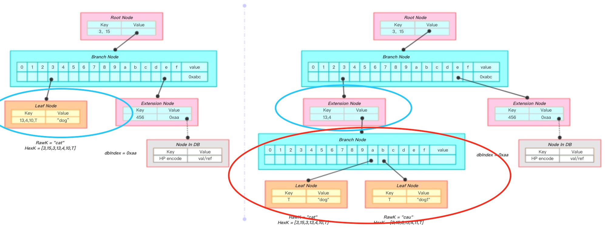

上图是一次将key为“cau”, value为“dog1”节点插入的过程。

1.  将key"cau"转换成hex编码[3,15,3,13,4,11,T] ；
2.  通过查找算法，找到左图蓝线圈出的节点node1，且拥有与新插入节点最长的共同前缀[3,15,3,13,4]；
3.  新增一个分支节点node2，将node1的val与新节点作为孩子插入到node2的孩子列表中，将node1的val替换成node2；
4.  node1变成了一个扩展节点；

#### 4.3 Delete

删除操作与插入操作类似，都需要借助查找过程完成，一次删除过程为：

1. 根据4.1中描述的查找步骤，找到与需要插入的节点拥有**最长相同路径前缀**的节点，记为Node；
2. 若Node为叶子／扩展节点：
   1. 若剩余的搜索路径与node的Key完全一致，则将整个node删除；
   2. 若剩余的搜索路径与node的key不匹配，则表示需要删除的节点不存于树中，删除失败；
   3. 若node的key是剩余搜索路径的前缀，则对该节点的Val做递归的删除调用；
3. 若Node为分支节点：
   1. 删除孩子列表中相应下标标志的节点；
   2. 删除结束，若Node的孩子个数只剩下一个，那么将分支节点替换成一个叶子／扩展节点；
4. 若删除成功，则将被修改节点的dirty标志置为true，hash标志置空（之前的结果已经不可能用），且将节点的诞生标记更新为*现在*；

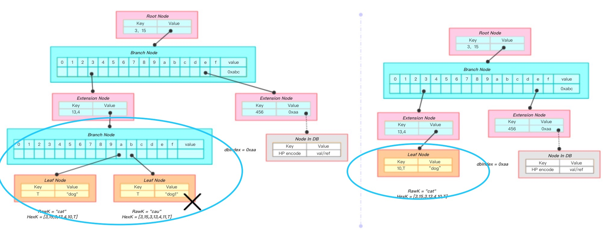

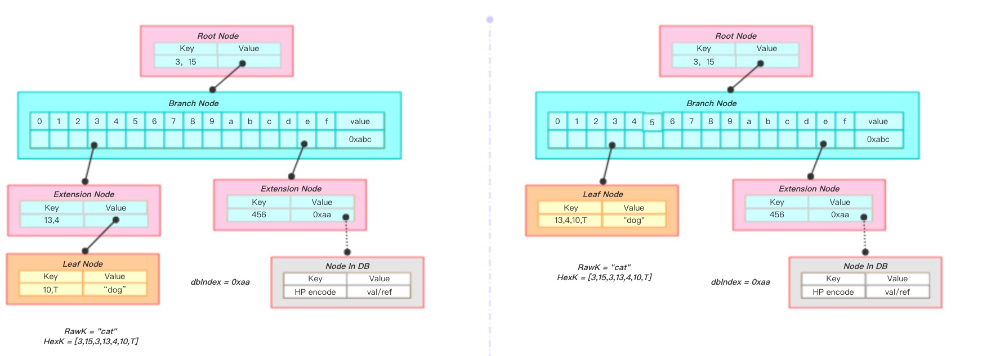

上面两幅图是一次将key为“cau”, value为“dog1”节点删除的过程。

1.  将key"cau"转换成hex编码[3,15,3,13,4,11,T] ；
2.  通过查找算法，找到用叉表示的节点node1，从根节点到node1的路径与搜索路径完全一致；
3.  从node1的父节点中删除该节点，父节点仅剩一个孩子节点，故将父节点转换成一个叶子节点；
4.  新生成的叶子节点又与其父节点（扩展节点）发生了合并，最终生成了一个叶子节点包含了所有的信息（图2）；

#### 4.4 Update

更新操作就是4.2Insert与4.3Delete的结合。当用户调用Update函数时，若value不为空，则隐式地转为调用Insert；若value为空，则隐式地转为调用Delete，故在此不再赘述。

#### 4.5 Commit

Commit函数提供将*内存*中的MPT数据持久化到*数据库*的功能。在第一章中我们提到的MPT具有*快速计算所维护数据集哈希标识*以*快速状态回滚*的能力，也都是在该函数中实现的。

在commit完成后，所有**变脏**的树节点会重新进行哈希计算，并且将新内容写入数据库；最终新的根节点哈希将被作为MPT的最新状态被返回。

一次MPT树提交是一个递归调用的过程，在介绍MPT提交过程之前，我们首先介绍单个节点是如何进行哈希计算和存储的。

**单节点**

1. 首先是对该节点进行脏位的判断，若当前节点未被修改，则直接返回该节点的哈希值，调用结束（此外，若当前节点既未被修改，同时存在于内存的时间又”过长“，则将以该节点为根节点的子树从内存中驱除）；
2. 该节点为脏节点，对该节点进行哈希重计算。首先是对当前节点的孩子节点进行哈希计算，对孩子节点的哈希计算是利用递归地对节点进行处理完成。这一步骤的目的是**将孩子节点的信息各自转换成一个哈希值进行表示**；。
3. 对当前节点进行哈希计算。哈希计算利用sha256哈希算法对当前节点的***RLP编码***进行哈希计算；
   1. 对于分支节点来说，该节点的RLP编码就是对其孩子列表的内容进行编码，且在第二步中，所有的孩子节点所有已经被转换成了一个哈希值；
   2. 对于叶子／扩展节点来说，该节点的RLP编码就是对其Key，Value字段进行编码。同样在第二步中，若Value指代的是另外一个节点的引用，则已经被转换成了一个哈希值（在第二步中，Key已经被转换成了HP编码）；
4. 将当前节点的数据存入数据库，存储的格式为[节点哈希值，节点的RLP编码]。
5. 将自身的dirty标志置为false，并将计算所得的哈希值进行缓存；

**MPT树的提交过程**

在理解单节点的提交过程后，MPT树的提交过程就是以根节点为入口，对根节点进行提交调用即可。

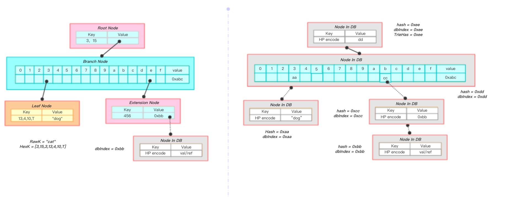

上图展示一棵MPT被持久化的过程：

左下角的叶子节点计算得到哈希为0xaa，将其存入数据库中，并在其父节点中用哈希值进行替换；粉色的扩展节点计算得到哈希为0xcc，在父节点用中0xcc进行替换；递归至根节点，计算得到根节点的哈希为0xee，即整棵树的哈希为0xee。

**节点过老的判断依据**

> 判断一个节点在内存中存在时间是否过长的依据是：
>
> 1. 该节点未被修改；
> 2. 当前MPT的计数器减去节点的诞生标志超过了固定的上限；
> 3. 每当MPT调用一次Commit函数，MPT的计数器发生自增；

**实现功能**

1. 快速计算所维护数据集哈希标识

这个特点体现在单节点计算的第一步，即在节点哈希计算之前会对该节点的状态进行判断，只有当该节点的内容变脏，才会进行哈希重计算、数据库持久化等操作。如此一来，在某一次事务操作中，对整棵MPT树的部分节点的内容产生了修改，那么一次哈希重计算，仅需对这些被修改的节点、以及从这些节点到根节点路径上的节点进行重计算，便能重新获得整棵树的新哈希。

2. 快速状态回滚

在公链的环境下，采用POW算法是可能会造成分叉而导致区块链状态进行回滚的。在以太坊中，由于出块时间短，这种分叉的几率很大，区块链状态回滚的现象很频繁。

所谓的状态回滚指的是：（1）区块链内容发生了重组织，链头发生切换（2）区块链的世界状态（账户信息）需要进行回滚，即对之前的操作进行撤销。

MPT树就提供了一种机制，可以当分叉的时候，零延迟地完成世界状态的回滚。这种机制的代价就是需要浪费存储空间去冗余地存储每个节点的历史状态。

**每个节点在数据库中的存储都是值驱动的**。当一个节点的内容发生了变化，其哈希相应改变，而MPT将哈希作为数据库中的索引，也就实现了对于**每一个值**，在数据库中都有一条**确定的记录**。而MPT是根据节点哈希来关联父子节点的，因此每当一个节点的内容发生变化，最终对于父节点来说，改变的只是一个哈希索引值；父节点的内容也由此改变，产生了一个新的父节点，递归地将这种影响传递到根节点。**最终，一次改变对应创建了一条从被改节点到根节点的新路径，而旧节点依然可以根据旧根节点通过旧路径访问得到**。

示例：


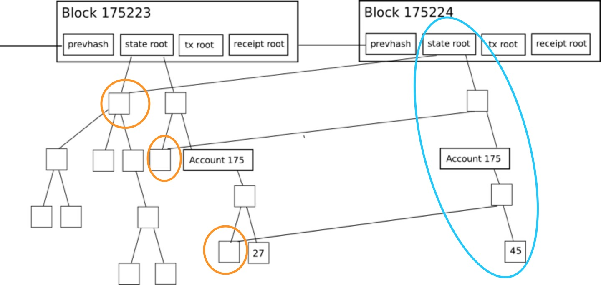

在上图中，一个节点的内容由27变为45，就对应成创建了一条由蓝线圈出的新路径，通过复用绿线圈出的未修改节点信息，构造一棵新树，而旧路径依旧保留。故通过旧stateRoot，我们依旧能够查询到该节点的值为27。

所以，在以太坊中，发生分叉而进行世界状态回滚时，仅需要用旧的MPT根节点作为入口，即可完成“状态回滚”。

### 5. 轻节点扩展

接下来来介绍一个默克尔树，MPT能够提供的一个重要功能 - 默克尔证明，使用默克尔证明能够实现轻节点的扩展。

#### 5.1 什么是轻节点

在以太坊或比特币中，一个参与共识的全节点通常会维护整个区块链的数据，每个区块包含区块头信息，所有的交易，回执信息等。由于区块链的不可篡改性，这将导致随着时间的增加，整个区块链的数据体量会非常庞大。运行在个人PC或者移动终端的可能性显得微乎其微。为了解决这个问题，一种轻量级的，**只存储区块头部信息**的轻节点被提出。这种节点只需要维护链中所有的区块头信息（一个区块头的大小通常为几十个字节，普通的移动终端设备完全能够承受）。

在公链的环境下，**仅仅通过本地所维护的区块头信息**，轻节点就能够证明某一笔交易是否存在于区块链中；某一个账户是否存在与区块链中，其余额是多少等功能，这就是**简单支付验证**。

#### 5.2 什么是默克尔证明

默克尔证明指一个轻节点向一个全节点发起一次证明请求，询问全节点完整的默克尔树中，是否存在一个指定的节点；全节点向轻节点返回一个默克尔证明路径，由轻节点进行计算，验证存在性。

#### 5.3 默克尔证明过程

如有棵如下图所示的merkle树，如果某个轻节点想要验证`9Dog:64`这个树节点是否存在与默克尔树中，只需要向全节点发送该请求，全节点会返回一个`1FXq:18`, `ec20`,
`8f74`的一个路径（默克尔路径，如图2黄色框所表示的）。得到路径之后，轻节点利用`9Dog:64`与`1FXq:18`求哈希，在与`ec20`求哈希，最后与`8f74`求哈希，得到的结果与本地维护的根哈希相比，是否相等。

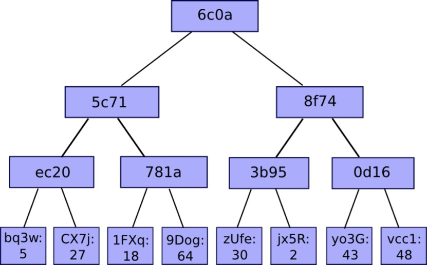

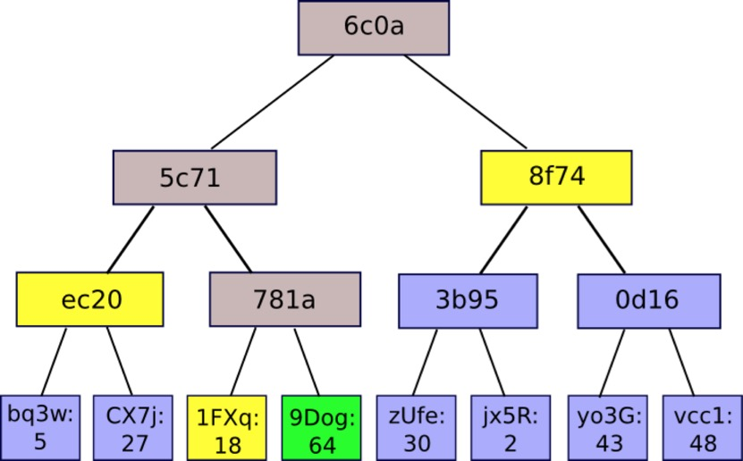

#### 5.4默克尔证明安全性

（1）若全节点返回的是一条恶意的路径？试图为一个不存在于区块链中的节点伪造一条合法的merkle路径，使得最终的计算结果与区块头中的默克尔根哈希相同。

由于哈希的计算具有不可预测性，使得一个恶意的“全”节点想要为一条不存在的节点伪造一条“伪路径”使得最终计算的根哈希与轻节点所维护的根哈希相同是不可能的。

（2）为什么不直接向全节点请求该节点是否存在于区块链中？

由于在公链的环境中，无法判断请求的全节点是否为恶意节点，因此直接向某一个或者多个全节点请求得到的结果是无法得到保证的。但是轻节点本地维护的区块头信息，是经过工作量证明验证的，也就是经过共识一定正确的，若利用全节点提供的默克尔路径，与待验证的节点进行哈希计算，若最终结果与本地维护的区块头中根哈希一致，则能够证明该节点一定存在于默克尔树中。

#### 5.5 简单支付验证

在比特币或者以太坊网络中，对一批交易数据进行处理，构建一棵默克尔树，在逻辑上可以认为默克尔树的每个叶子节点存储了一条交易的信息。

客户端可以向一个轻节点发起查询，询问指定哈希的交易是否已经被收录在区块链中；轻节点向相邻的全节点发起一次默克尔证明，回复客户端这笔交易是否已经被收录。这个过程，就是一次简单支付验证的过程。

### 6.作者

戎佳磊，浙江大学VLIS实验室在读研究生。

以太坊爱好者&贡献者

hyperchain平台核心开发

garyrong0905@gmail.com

### 7. 参考资料

* [https://github.com/ethereum/wiki/wiki/Patricia-Tree](https://github.com/ethereum/wiki/wiki/Patricia-Tree)
* [http://gavwood.com/paper.pdf](http://gavwood.com/paper.pdf)
* [https://zh.wikipedia.org/wiki/Trie](https://zh.wikipedia.org/wiki/Trie)
* [https://en.wikipedia.org/wiki/Merkle_tree](https://en.wikipedia.org/wiki/Merkle_tree)
* [https://github.com/ethereum/wiki/wiki/Design-Rationale](https://github.com/ethereum/wiki/wiki/Design-Rationale)
* [https://github.com/ethereum/wiki/wiki/Light-client-protocol](https://github.com/ethereum/wiki/wiki/Light-client-protocol)