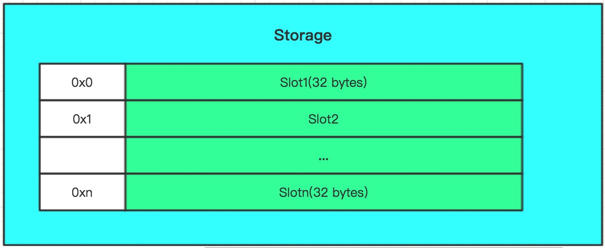

# Solidity合约的变量存储

### 1. 存储结构

智能合约定义的变量都被存储在合约相关的`Storage`中。在介绍变量存储之前，先介绍一下`Storage`的结构。一个简单的`Storage`示意图如下所示：



`storage`的结构与普通的存储结构相同，每一个存储单位称为一个**槽**,大小为32个字节，每一个槽都有个对应的**槽地址**。

一个合约变量经过一些映射规则得到它在`storage`中的**索引**,存储在相应的槽中。

那么有两个问题：

1. 变量在账本中的索引值是通过什么规则生成的
2. 变量存放在`storage`中的内容是怎么编码的

下文将围绕这两个问题展开。

### 2. 变量索引生成规则

#### 2.1 示例

变量索引的生成是发生在合约的**编译阶段**，编译器根据变量的类型分别应用不同的规则为其生成索引值。某些复杂变量的索引值通过哈希算法生成，在不考虑哈希冲突的前提下，我们可以认为每一个变量在`Storage`中都有一相应的索引值

> 为了节省存储空间，某些`连续`的变量会被压缩存入同一个槽中，因此这些变量拥有一个共同的槽地址。
>
> 这些"小变量"在读取时需要一些额外的操作。由于每次在`storage`中读取的都是一整个槽，因此为了获取小变量的值，通常需要一些额外的位操作。

我们先以一个示例合约为例，来看一下映射到账本中，这些变量的索引值是什么。 

```
contract Demo1 {
    uint    var1;
    mapping (uint => bytes32) var2;
    
    function Demo1() {
        var1 = 10;
        var2[20] = "helloworld";
    }
}

```

在合约中定义两个变量：整型变量var1以及map对象var2。在构造函数中，将变量1的值赋为10，在变量2中加入了一个key为20，value为“helloworld”的键值对。这些变量在账本中被记录为：

```
"storage": {
                "0000000000000000000000000000000000000000000000000000000000000000": "000000000000000000000000000000000000000000000000000000000000000a",
                "467a5c61216cad3003bc3395c339807c735d5c3d989ca4bc0ef2a37e14ce2679": "68656c6c6f776f726c6400000000000000000000000000000000000000000000"
},

```

`storage`中加入了两条记录，第一条记录对应着第一个变量，第二条记录对应着第二个map变量中**key为20的元素**（map变量本身在`storage`中没有相应的记录！）。这两条记录的key是根据不同的规则生成的，接下来我们具体讲讲这些生成规则都有哪些。


#### 2.2 变量分类

首先介绍一下solidity中变量的分类。在Solidity中，可以分为两大类变量：

* 静态变量
* 动态变量

#### 2.2.1 静态变量

所谓静态变量指的是该变量的大小是固定的。例如`uint`，其是`uint256`的一个别名，代表一个大小为32个字节的无符号整数，在账本中用一个独立的槽来存储。（一个槽的容量为32个字节），又如`bytes32`表示一个大小为32个字节的字符串等。

**所有静态变量**被连续地存放在以地址`0x0`开头的`storage`空间中，存放的顺序与该变量在合约中的定义顺序一致。由于`storage`中每个槽的空间为32个字节，因此某些较小的变量会被压缩存储在一个槽中。


静态变量存储的规则主要有几下三点：


1. 在一个槽中，变量存储采用右端对齐

2. 基本变量在槽中只占用与之大小相同的空间

3. 某个基本变量在对应的槽中无法完整得存下时，将会被存储到相邻的下一个槽中

4. 结构体，数组变量总是使用一个新的槽来存储，且该槽不再用来存储其他变量

结构体内的每一个字段被视为一条单独的记录，这些字段被按序依次存储；数组中的每个元素也是按序存储。

> 值得注意的是，固定长度的数组是一种静态变量，
>
> ```
> 1. 
> uint[3] vars
>
> 2. 
> uint var1
> uint var2
> uint var3
> ```
>
> 以上两种变量定义方式在`storage`的视角中等价
>
> 而不固定长度的数据则是动态变量，会在下文介绍

#### 2.2.2 动态变量

动态类型的变量主要有2种：

* map
* 动态长度数组(包括`string`, `bytes`)

先说map。在`storage`会为map变量分配一个槽，只不过**这个槽不存入任何数据**。map中所有的记录被**散列存储**在`storage`中


由于无法确定map变量需要的存储空间到底是多少，因此solidity采用了哈希算法来计算map变量中**每一条记录**在`storage`所对应的索引值。哈希算法有两个输入参数： 

1. 记录的key值 
2. 分配给map变量的槽地址p

该记录在`storage`中的索引值由以下计算公式得出

pos := keccak256(key * p) (*表示连接运算)

```
contract C {
  struct s { uint a; uint b; }
  uint x;
  mapping(uint => mapping(uint => s)) data;
}

```

则`data[4][9].b`的`storage`索引值为`keccak256(uint256(9) . keccak256(uint256(4) . uint256(1))) + 1`

> 为什么map变量本身其实并不存入`storage`，还需要为它分配一个槽的空间呢？
>
> 为了将这个槽地址作为哈希计算的一个输入，用于区分两个map变量中相同key的记录
>


说完map，再来说说动态长度的数组

动态长度的数组与map类似，在`storage`会为数组变量分配一个槽。在这个槽中用来存储该动态数组的实际长度（`bytes`和`string`除外）。

至于数据中的每一个元素，与map相似，由于无法得知动态数组真正需要的存储空间的大小，solidity利用哈希算法为这个动态数组**分配一片连续的存储空间**. 动态数组的数据存储在以keccak256(p)为起始地址的一片连续的存储空间中，p为分配给动态数组变量的槽地址。至于数组中的每一个元素，则依次按序存储在这片空间中。

> 那么，要是动态数组中的元素是一个map或者其他复杂类型的变量呢？
>
> 递归的使用上述规则计算索引值

至于`bytes`和`string`这两种类型的变量，本质就是一个byte数组，只不过与普通的数组不同的是，除了在分配给该变量的槽中存储byte字符的个数外，当byte字符串长度不超过31个字节时，字符数据也会与长度一起存在该槽中;当字符个数超过31个字节时，该槽只存储byte字符的个数，而字符数据会被存在以`keccak256(slot)`为起始地址的空间中。

> 1. 当字符数不超过31字节时，字符个数用 `2 * length` 表示
>
> 2. 当字符数超过31字节时，字符个数用 `2 * length + 1` 表示
>
> 3. 字符数据存储时采用左端对齐


#### 2.3 实战

好了，让我们来看一个全面的demo！

```
contract Demo {
    struct User {
        uint8   id;
        uint    age;
        bytes32 name;
    }
    
    uint8    var1;
    uint8    var2;
    uint16   var3;
    uint16   var4;
    uint     var5;
    
    string  var6;
    string  var7;

    uint[10] var8;
    mapping(uint => bytes32) var9;    
    
    User[] users;
    
    function Demo() {
        var1 = 1;
        var2 = 2;
        var3 = 3;
        var4 = 4;
        var5 = 5;
        var6 = "helloworld"; // length  = 10
        var7 = "helloworldhelloworldhelloworldhelloworldhelloworld"; // length = 5
        var8[0] = 100;
        var8[1] = 101;
        var8[2] = 102;
        
        var9[0] = "hello";
        var9[1] = "world";
        
        users.push(User(1, 10, "hello"));
        users.push(User(1, 10, "world"));
    }
}

```

storage内容为

```

"storage": {
                "0000000000000000000000000000000000000000000000000000000000000000": "0000000000000000000000000000000000000000000000000000000400030201",
                "0000000000000000000000000000000000000000000000000000000000000001": "0000000000000000000000000000000000000000000000000000000000000005",
                "0000000000000000000000000000000000000000000000000000000000000002": "68656c6c6f776f726c6400000000000000000000000000000000000000000014",
                "0000000000000000000000000000000000000000000000000000000000000003": "0000000000000000000000000000000000000000000000000000000000000065",
                "0000000000000000000000000000000000000000000000000000000000000004": "0000000000000000000000000000000000000000000000000000000000000064",
                "0000000000000000000000000000000000000000000000000000000000000005": "0000000000000000000000000000000000000000000000000000000000000065",
                "0000000000000000000000000000000000000000000000000000000000000006": "0000000000000000000000000000000000000000000000000000000000000066",
                "000000000000000000000000000000000000000000000000000000000000000f": "0000000000000000000000000000000000000000000000000000000000000002",
                "8d1108e10bcb7c27dddfc02ed9d693a074039d026cf4ea4240b40f7d581ac802": "0000000000000000000000000000000000000000000000000000000000000001",
                "8d1108e10bcb7c27dddfc02ed9d693a074039d026cf4ea4240b40f7d581ac803": "000000000000000000000000000000000000000000000000000000000000000a",
                "8d1108e10bcb7c27dddfc02ed9d693a074039d026cf4ea4240b40f7d581ac804": "68656c6c6f000000000000000000000000000000000000000000000000000000",
                "8d1108e10bcb7c27dddfc02ed9d693a074039d026cf4ea4240b40f7d581ac805": "0000000000000000000000000000000000000000000000000000000000000001",
                "8d1108e10bcb7c27dddfc02ed9d693a074039d026cf4ea4240b40f7d581ac806": "000000000000000000000000000000000000000000000000000000000000000a",
                "8d1108e10bcb7c27dddfc02ed9d693a074039d026cf4ea4240b40f7d581ac807": "776f726c64000000000000000000000000000000000000000000000000000000",
                "a7c5ba7114a813b50159add3a36832908dc83db71d0b9a24c2ad0f83be958207": "776f726c64000000000000000000000000000000000000000000000000000000",
                "c2575a0e9e593c00f959f8c92f12db2869c3395a3b0502d05e2516446f71f85b": "68656c6c6f776f726c6468656c6c6f776f726c6468656c6c6f776f726c646865",
                "c2575a0e9e593c00f959f8c92f12db2869c3395a3b0502d05e2516446f71f85c": "6c6c6f776f726c6468656c6c6f776f726c640000000000000000000000000000",
                "e710864318d4a32f37d6ce54cb3fadbef648dd12d8dbdf53973564d56b7f881c": "68656c6c6f000000000000000000000000000000000000000000000000000000"
 }

```

在合约中共定义了10个变量：

* var1: 8位大小的无符号整数
* var2: 8位大小的无符号整数
* var3: 16位大小的无符号整数
* var4: 16位大小的无符号整数
* var5: 256位大小的无符号整数
* var6: 长度为10的字符串
* var7: 长度为50的字符串
* var8: 长度为10的256位大小无符号整数数组
* var9: map
* users: 自定义结构体User动态数组

可以看到var1,var2,var3,var4四个变量被压缩存储在了slot0里（右端对齐），而var5为一个大小为32字节的变量，slot0剩余的空间不足以存储，因此将var5存储在slot1里。

var6是一个长度为10的字符串，由于数据量较小，因此与字符串长度一起存放在了slot2里；
而var7是一个长度为50的字符串，因此在slot3中只存储字符串长度，而在keccak256(slot3)即`c2575a0e9e593c00f959f8c92f12db2869c3395a3b0502d05e2516446f71f85b `开始的空间存储字符数据

var8是一个长度为10的静态数组，因此从slot4-slot13这段存储空间用来存储var8的内容。

var9是一个map变量，map变量被分配了slot14，但是由于其没有存储任何内容，因此在storage中没有打印出来。
第一条记录(key:0, value: "hello")被存放在地址为`e710864318d4a32f37d6ce54cb3fadbef648dd12d8dbdf53973564d56b7f881c `的槽中；而第二条记录（key:1, value: "world"）被存放在地址为`a7c5ba7114a813b50159add3a36832908dc83db71d0b9a24c2ad0f83be958207 `的槽中。

至于变量users，其是一个自定义结构体User的一个数组，因此在slot15中存放该数组长度2，在`8d1108e10bcb7c27dddfc02ed9d693a074039d026cf4ea4240b40f7d581ac802`为起始地址的存储空间中存放数据内容。

### 3.变量编码规则

讲完了变量的索引生成规则，接下来我们来了解一下每个变量通过何种方式编码存储到`storage`中。`storage`中存储的数据都是以byte数组格式编码的，因此让我们来了解下每种不同的类型是采用何种编码方式将`原始内容`转换成byte数组格式

* bool变量

一个bool变量用8位存储，最低位存储1或者0表示true或者false，采用右端对齐。

* 整型变量

整型变量按照标准的整型编码规则进行编码，编码的内容采用右端对齐；根据变量类型为其分配相应的存储空间

* Address变量

地址变量是一种solidity特有的变量类型，用来表示一个以太坊合约账户。其大小为20个字节，编码方式与标准的字符串编码相同，采用右端对齐。

* 静态byte数组（bytes1 ... bytes32）

静态byte数组根据变量的长度不同共有32种类型,其编码方式与标准的字符串编码相同，采用左端对齐。

* 动态byte变量（bytes, string）

字符数据采用标准字符编码方式编码，**字符数据左端对齐**；字符长度用标准整型编码，**字符长度采用右端对齐**，存放在对应槽的最低位


