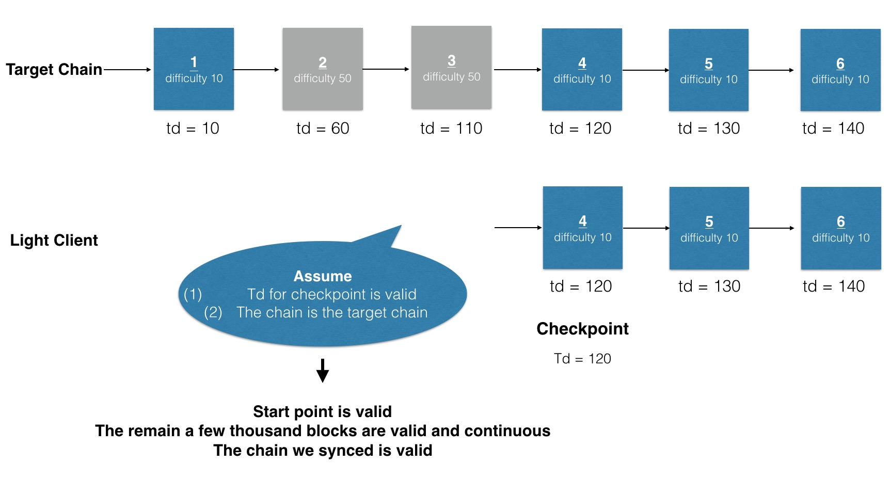
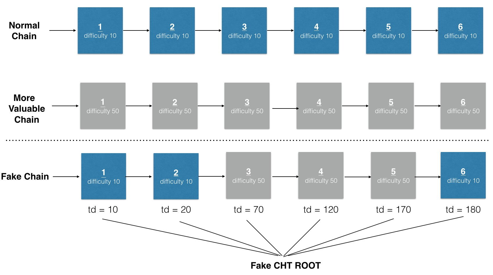
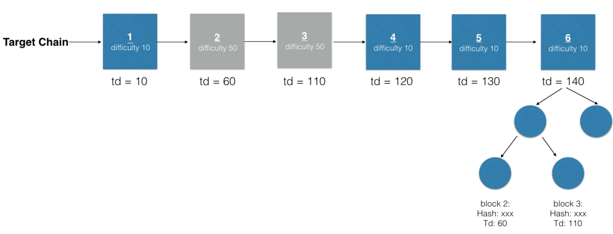

# Consideration for trustless checkpoint syncing

## Basic Process

1. Light client receives a handshake package from the server peer and assumes tha advertised checkpoint and total difficulty is correct.
2. Light client syncs with target peer based on the advertised checkpoint.
3. Light client filters for the log event with the announced checkpoint in the range `chtIndex*32768+256` to `head`, make sure the advertised checkpoint is equal with the registered one.
4. Check pow validation for some unsynced epoch(the greater the epoch TD, the higher the probability of checking).
5. Run td checking and chain identification checking for all unsynced epochs  with an average frequency of 1 in 2000

## Rationale



We start checkpoint syncing from a start point called `headerSyncStart`. We assume the **advertised td** of `headSyncStart` is valid and **the chain identification** is valid before we start syncing.

Than we use `lightSyncing` to ensure all remain a few thousands blocks downloaded are **valid and continuous**.

So the most three important points are: (1) All blocks are Pow Valid (2) Chain is continuous (3) The chain is the chain we want to sync. When these three conditions are satisfied, and the td of the chain is highest, we can say we sync the correct chain.

### Current approach

Now we use the hardcode checkpoint as the `headerSyncStart`. We assume geth user trust core developers and core developers are honest people, so that the hard code checkpoint can satisfy these two conditions:

* Td is valid
* Chain identification is valid(Main net, ropsten testnet, private chain)

### Trustless checkpoint syncing

We need some security checking to ensure that if a maclious attacker makes a fake chain and gives us a fake advertised checkpoint, we can detect it easily.

The security checking should focus on these aspects:

(1) Pow validation

(2) Chain continuity

(3) Chain identification

**Total difficulty checking**

```Go
func tdCheck(A, B) bool {
  if B.number == A.number+1 {
    return B.td == A.td + B.diff
  }
  if B.td - A.td <= MAX(A.diff, B.diff)*(B.number-A.number) {
    return true
  }
  C := GetBlockByNumber((A.number+B.number)/2])
  return tdCheck(A, C) && tdCheck(C, B)
}
```

**Challenge 1**

Attacker can add some valid blocks from a more valuable chain and make a fake chain and cht root.

If we run tdCheck on block1, block3: `3.Td - 1.Td <= Max(1.Diff, 3.Diff) * 2`, checking pass, detection failed.




**Challenge 2**

We can not trust the td provided by remote target peer with the advertised checkpoint even this advertised checkpoint equal with the registered one.



Because the attacker can register their own checkpoint information in the contract, so when we try to filter or fetch trie node from the fake chain, we can also get the checkpoint which equal with the advertised one.

when we run tdcheck on block1, block2, `B.td == A.td + B.diff`, but these two blocks are not continous.

We can only assure the blocks are continuous by `ethash.VerifyHeader`, td continuity  can not guarantee anything.


